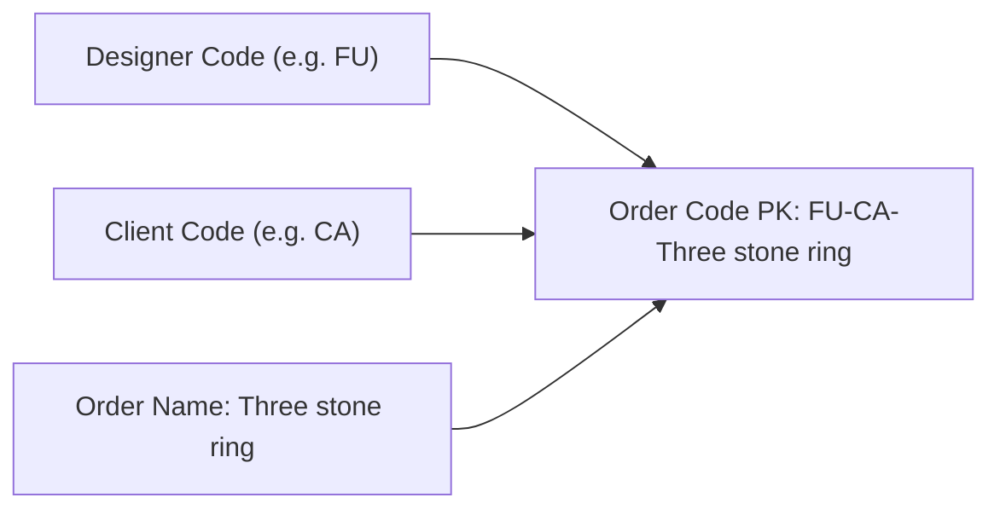
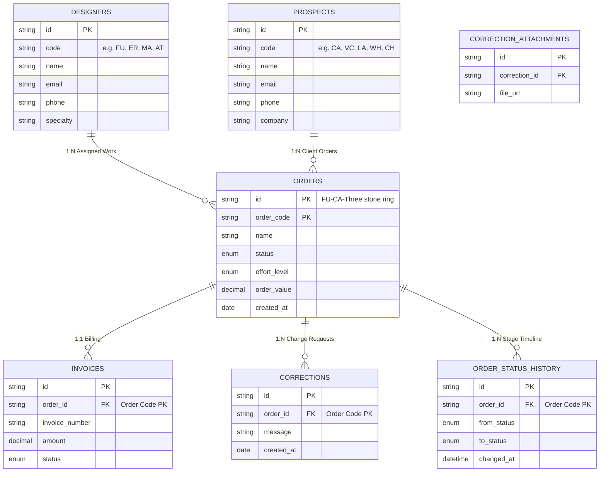

# AuraCAD — Technical Architecture & Build Specification

## System Overview & Target
- **Target OS**: Responsive Cross-Platform (Desktop Windows 11 + Mobile iOS/Android via Tailscale mesh)
- **Application Category**: Digital Office System & Bespoke Jewelry Order Engine
- **UI Architecture**: Mantine UI (`@mantine/core` v7+, `@mantine/hooks`) + Creative Tim design block systems + Tailwind CSS v4
- **Persistence**: Dexie.js v4 IndexedDB (`AuraCAD_DigitalOffice_v2`) + PocketBase SQLite sync

---

## Technical Stack & Dependency Justification

| Dependency | Version | Purpose & Rationale |
| :--- | :--- | :--- |
| `@mantine/core` | `^7.17.6` | Accessible, robust React components (Cards, Badges, Timeline, Drawers, Modals, Forms, Grid) |
| `@mantine/hooks` | `^7.17.6` | Reactive viewport (`useMediaQuery`), disclosure, and clipboard hooks |
| `react` / `react-dom` | `^19.0.1` | Modern concurrent rendering and component composition |
| `vite` | `^6.2.3` | Instant HMR (<500ms), lightning-fast ES module bundler |
| `tailwindcss` / `@tailwindcss/vite` | `^4.1.14` | High-performance CSS engine with atomic utility tokens and native glassmorphism styling |
| `dexie` / `dexie-react-hooks` | `^4.4.6` | Offline-first IndexedDB persistence engine with zero data dead-ends (`AuraCAD_DigitalOffice_v2`) |
| `pocketbase` | `^0.28.1` | High-performance Go/SQLite backend with real-time subscriptions, auth, and role management |
| `lucide-react` | `^0.546.0` | Clean vector iconography aligned with luxury jewelry and digital office metaphors |
| `uuid` | `^14.0.1` | Collision-free entity IDs for invoices and corrections |

---

## Responsive & Mobile Architecture

### 1. Viewport & Touch Optimization
- Configured in `index.html`:
  `width=device-width, initial-scale=1.0, maximum-scale=1.0, user-scalable=no, viewport-fit=cover`
- Dark luxury theme color `#050608` for native browser status bar integration.
- Safe-area inset handling (`pb-[env(safe-area-inset-bottom)]`) to prevent home bar collision on iPhone / modern Android devices.

### 2. Dual-Mode UI Paradigm
| UI Component | Desktop Layout (`md:block` / `md:flex`) | Mobile Layout (`md:hidden`) |
| :--- | :--- | :--- |
| **Top Navigation** | Full horizontal banner with status badges, role badge, action pills | Compact sticky header with hamburger drawer trigger |
| **Bottom Navigation** | Hidden | Floating thumb-dock with 4 core tabs and active count indicators |
| **Orders Table** | Multi-column table with hover effects, effort badges, financial values | Touch-friendly card feed with quick action pills and 1-tap inspector |
| **Designers Directory**| 6-column tabular layout with inline stats | Card view with direct tap-to-call (`tel:`) and tap-to-email (`mailto:`) |
| **Clients (Prospects)**| Full CRM ledger with company details & pipeline spend | Compact portfolio cards with quick "+ Order" shortcut |
| **Invoices Ledger** | Dense financial table with status select | Billing summary cards with order code linkage |
| **Drawers & Modals** | Side flyout (`size="xl"`, 600px width) | Full-screen adaptive sheet (`size="100%"`, `fullScreen={true}`) |
| **Status Steppers** | Linear step row | Horizontally scrollable overflow bar with no scrollbar |

---

## Order Code Primary Key (PK) Schema

The Order entity uses a 3-part concatenated primary key:
$$\text{Order Code (PK)} = \langle\text{DesignerCode}\rangle\text{-}\langle\text{ClientCode}\rangle\text{-}\langle\text{OrderName}\rangle$$

### Example:
- **Designer**: Farooq Qureshi $\to$ Code: `FU`
- **Client**: Crown Atelier $\to$ Code: `CA`
- **Order Name**: `Three stone ring`
- **Generated Order Code (PK)**: `FU-CA-Three stone ring`

---

## Relational Data Architecture (Strict ER Alignment)

