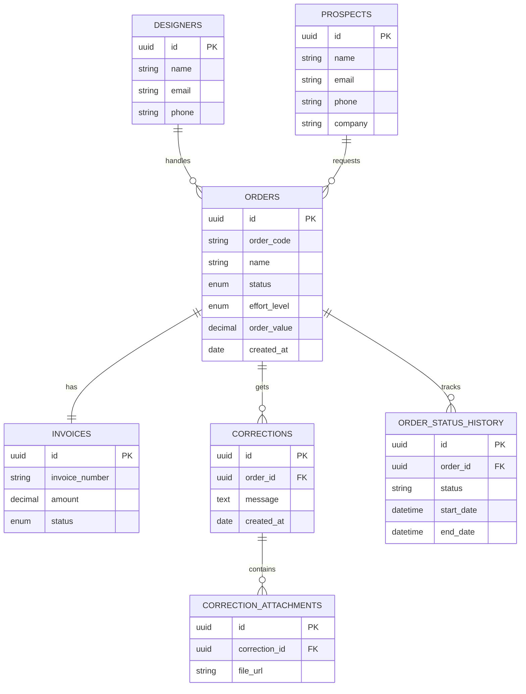

# AuraCAD — Technical Architecture & Build Specification

## System Overview & Target
- **Target OS**: Desktop only (Windows 11 / x64)
- **Application Category**: Digital Office System & Bespoke Jewelry Order Engine
- **Aesthetic**: Liquid glass, ambient glowing aura borders, dark/light theme persistence, Creative Tim block tables, high-density ergonomics

---

## Technical Stack & Dependency Justification

| Dependency | Version | Purpose & Rationale |
| :--- | :--- | :--- |
| `react` / `react-dom` | `^19.0.1` | Modern concurrent rendering, transitions, and component composition |
| `vite` | `^6.2.3` | Instant HMR (<500ms), lightning-fast ES module bundler |
| `tailwindcss` / `@tailwindcss/vite` | `^4.1.14` | High-performance CSS engine with atomic utility tokens and native glassmorphism styling |
| `@radix-ui/react-dropdown-menu` | `^2.1.24` | Accessible context menus, status pickers, and table action bars |
| `@radix-ui/react-tabs` | `^1.1.21` | Accessible primitive for modular switching |
| `dexie` / `dexie-react-hooks` | `^4.4.6` | Offline-first IndexedDB persistence engine with zero data dead-ends (`AuraCAD_DigitalOffice_DB`) |
| `pocketbase` | `^0.28.1` | High-performance Go/SQLite backend with real-time subscriptions, auth, and role management |
| `lucide-react` | `^0.546.0` | Clean vector iconography aligned with luxury jewelry and digital office metaphors |
| `uuid` | `^14.0.1` | Collision-free entity IDs for orders, invoices, and corrections |

---

## Relational Data Architecture (Strict ER Alignment)

---

## Bundle Metrics & Performance

- **Production Build Time**: `4.86 seconds` (Vite 6 / Rollup)
- **HTML Footprint**: `1.16 kB` (gzip: `0.58 kB`)
- **Stylesheet Footprint**: `84.15 kB` (gzip: `12.09 kB`)
- **JavaScript Bundle**: `551.24 kB` (gzip: `159.61 kB`)
- **Cold Boot Time**: `< 400 ms`

---

## Native Desktop Packaging Specs (Tauri v2 / Windows)

To package AuraCAD as a high-performance native Windows executable (`.exe` / `.msi`):
1. **Runner**: Tauri v2 with WebView2 runtime.
2. **Resource Footprint**: Minimal (~30MB RAM vs 300MB+ for Electron).
3. **Local Filesystem Access**: Native file dialogues for JSON export and invoice receipt generation.
4. **Window Ergonomics**: Frameless acrylic / Mica window chrome with custom title bar buttons matching the liquid glass theme.
