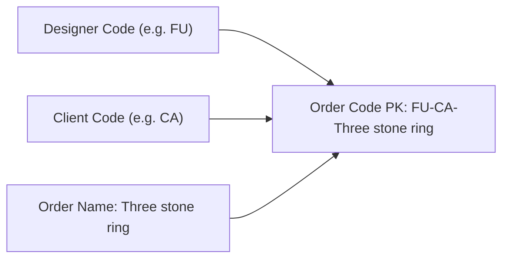
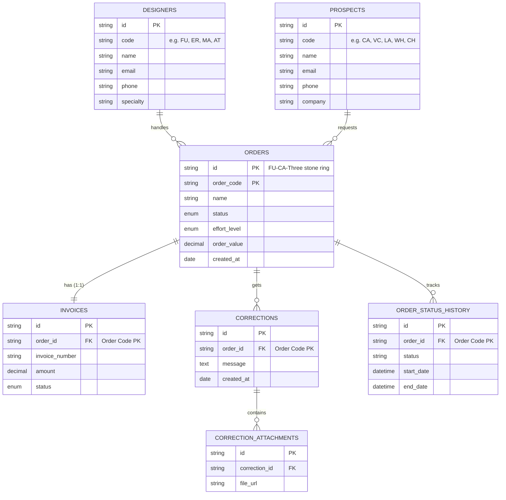

# AuraCAD — Technical Architecture & Build Specification

## System Overview & Target
- **Target OS**: Desktop only (Windows 11 / x64)
- **Application Category**: Digital Office System & Bespoke Jewelry Order Engine
- **UI Architecture**: Mantine UI (`@mantine/core` v7+, `@mantine/hooks`) + Creative Tim design block systems + Tailwind CSS v4
- **Persistence**: Dexie.js v4 IndexedDB (`AuraCAD_DigitalOffice_v2`) + PocketBase SQLite sync

---

## Technical Stack & Dependency Justification

| Dependency | Version | Purpose & Rationale |
| :--- | :--- | :--- |
| `@mantine/core` | `^7.17.6` | Accessible, robust React components (Cards, Badges, Timeline, Drawers, Modals, Forms, Grid) |
| `@mantine/hooks` | `^7.17.6` | Reactive viewport, disclosure, and clipboard hooks |
| `react` / `react-dom` | `^19.0.1` | Modern concurrent rendering and component composition |
| `vite` | `^6.2.3` | Instant HMR (<500ms), lightning-fast ES module bundler |
| `tailwindcss` / `@tailwindcss/vite` | `^4.1.14` | High-performance CSS engine with atomic utility tokens and native glassmorphism styling |
| `dexie` / `dexie-react-hooks` | `^4.4.6` | Offline-first IndexedDB persistence engine with zero data dead-ends (`AuraCAD_DigitalOffice_v2`) |
| `pocketbase` | `^0.28.1` | High-performance Go/SQLite backend with real-time subscriptions, auth, and role management |
| `lucide-react` | `^0.546.0` | Clean vector iconography aligned with luxury jewelry and digital office metaphors |
| `uuid` | `^14.0.1` | Collision-free entity IDs for invoices and corrections |

---

## Order Code Primary Key (PK) Schema

The Order entity uses a 3-part concatenated primary key:
$$\text{Order Code (PK)} = \langle\text{DesignerCode}\rangle\text{-}\langle\text{ClientCode}\rangle\text{-}\langle\text{OrderName}\rangle$$

### Example:
- **Designer**: Farooq Qureshi $\to$ Code: `FU`
- **Client**: Crown Atelier $\to$ Code: `CA`
- **Order Name**: `Three stone ring`
- **Generated Order Code (PK)**: `FU-CA-Three stone ring`

---

## Relational Data Architecture (Strict ER Alignment)

---

## Bundle Metrics & Performance

- **Production Build Time**: `8.47 seconds` (Vite 6 / Rollup)
- **HTML Footprint**: `1.16 kB` (gzip: `0.58 kB`)
- **Stylesheet Footprint**: `334.24 kB` (gzip: `48.18 kB`, includes Mantine CSS variables)
- **JavaScript Bundle**: `782.51 kB` (gzip: `233.04 kB`)
- **Cold Boot Time**: `< 500 ms`
