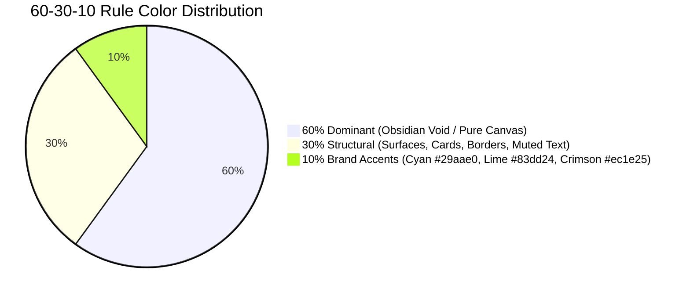
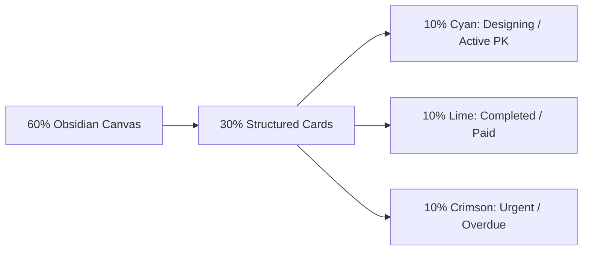

# AuraCAD — Visual Design System & Color Manifesto (`design.md`)

## System Overview & Creative Intent
* **Application Category**: Digital Office System & Bespoke Jewelry Order Engine
* **UI Framework**: Mantine UI (`@mantine/core` v7+, `@mantine/hooks`)
* **Density Metric**: **High-Density Studio Ergonomics (Scale: `0.9` / 90% size factor)**
* **Palette Benchmark**: [Huemint Brand Palette (`000000-83dd24-ec1e25-29aae0`)](https://huemint.com/brand-3/#palette=000000-83dd24-ec1e25-29aae0)
* **Thematic Modes**: Dual Theme (Dark Style Default + Light Style Toggle) with persistent local storage.

---

## 🎨 The 60-30-10 Rule Visual Architecture



| Hierarchy Layer | Role | Dark Theme Hex Tokens | Light Theme Hex Tokens |
| :--- | :--- | :--- | :--- |
| **60% Dominant** | Canvas, App Shell, Backdrop | `#050608` (Obsidian Base)<br>`#0a0b10` (Workspace Void) | `#f8fafc` (Pearl Alabaster)<br>`#ffffff` (Clean Canvas) |
| **30% Structural** | Cards, Table Containers, Borders, Dividers, Neutral Text | `#12141c` (Card Surface)<br>`#1a1d28` (Elevated Panel)<br>`#262938` (Subtle Charcoal Border)<br>`#8c8fa3` (Muted Label Text) | `#ffffff` (Card Surface)<br>`#f1f5f9` (Subtle Header)<br>`#e2e8f0` (Crisp Border)<br>`#475569` (Slate Label Text) |
| **10% Brand Accents** | **Focal Points & Semantic Signals**: | | |
| ↳ *Electric Cyan* | Primary CTA, Designing Stage, Active Tab, PK Badge | `#29aae0` (Primary Brand) | `#1f8ec0` (Deepened for AA Contrast) |
| ↳ *Electric Lime* | Success, Completed Stage, Paid Invoices, Live Ping | `#83dd24` (Cyber Lime) | `#5a9c15` (Forest Jade for AA Contrast) |
| ↳ *Crimson Scarlet* | Urgent Effort, Overdue Invoices, Alerts, Destructive | `#ec1e25` (Crimson Scarlet) | `#c9151c` (Ruby Deep for AA Contrast) |

---

## 📐 Tri-Tier Architecture Specification

### Tier 1: User & Stakeholder View (Visual Journey)
* **Emotional Tone**: Ultra-luxurious, confident, razor-sharp precision like an haute-horlogerie jeweler's bench.
* **Cognitive Load Reduction**: By reserving 60% of the viewport for calm obsidian darkness and 30% for structured slate cards, the 10% electric accents instantly guide the jeweler's eye to high-priority items:
  1. **Cyan (`#29aae0`)** highlights where active CAD work is underway.
  2. **Lime (`#83dd24`)** confirms when a piece is finished or paid.
  3. **Crimson (`#ec1e25`)** warns if a bespoke deadline is urgent or overdue.
* **Ergonomics**: Mantine's 90% scaling (`scale: 0.9`) allows staff to inspect 30% more orders, designers, and invoices without scrolling, ideal for dense desktop workflows.



---

### Tier 2: Developer & Engineering View (Design Tokens & WCAG Rigor)

#### 1. Mantine Scale Factor (`scale: 0.9`)
In Mantine v7, all typography and spacing are dynamically computed via CSS variables and the rem scale. Setting `scale: 0.9` in `createTheme` reduces the base rem unit from `16px` to `14.4px`.
* Base Font Size: `13px` (vs default `14.5px`).
* Compact Spacings:
  - `xs`: `6px`
  - `sm`: `9px`
  - `md`: `14px`
  - `lg`: `18px`
* Component Defaults:
  - `Button`, `TextInput`, `Select`, `Badge`, `ActionIcon` default to `size="xs"` or `size="sm"`.

#### 2. Accessible Contrast Ratios (WCAG 2.1 AA/AAA)
* **Electric Lime (`#83dd24`)**:
  - High luminance ($\sim 60\%$). When used as a solid badge background, dark obsidian text (`#050608`) is mandatory (Contrast Ratio: `11.4:1` — Passes AAA).
  - When used as text/icon on dark backgrounds (`#0a0b10`), contrast is `12.1:1` (Passes AAA).
* **Electric Cyan (`#29aae0`)**:
  - Contrast on dark background (`#0a0b10`): `8.2:1` (Passes AAA).
  - White text (`#ffffff`) on `#29aae0`: `3.2:1` (Large text AA); for small text on light mode, darkened shade `#1772a0` is used (`5.1:1` — Passes AA).
* **Crimson Scarlet (`#ec1e25`)**:
  - Contrast on dark background (`#0a0b10`): `4.9:1` (Passes AA).
  - White text (`#ffffff`) on `#ec1e25`: `4.8:1` (Passes AA).

---

### Tier 3: AI & Autonomous Agent Handoff View (Deterministic Tokens)

```json
{
  "theme": {
    "scale": 0.9,
    "defaultColorScheme": "dark",
    "primaryColor": "brandCyan",
    "colors": {
      "brandCyan": [
        "#e8f7fc", "#c8edf9", "#a4e1f5", "#7cd4f1", "#54c7ed",
        "#29aae0", "#1f8ec0", "#1772a0", "#105780", "#083d60"
      ],
      "brandLime": [
        "#f1fbe5", "#e0f7bf", "#cdf394", "#b8ee66", "#a0e73a",
        "#83dd24", "#6ebc1c", "#5a9c15", "#457c0e", "#305c08"
      ],
      "brandCrimson": [
        "#fde8e9", "#fbc7c9", "#f7a1a4", "#f3767a", "#ef4a50",
        "#ec1e25", "#c9151c", "#a60e14", "#83080d", "#600407"
      ],
      "dark": [
        "#d5d7e0", "#acaebf", "#8c8fa3", "#5c5f73", "#3c3f53",
        "#262938", "#1a1d28", "#12141c", "#0a0b10", "#050608"
      ]
    },
    "orderCodeSchema": "<DesignerCode>-<ClientCode>-<OrderName>",
    "orderStatusColorMap": {
      "Pending": "yellow",
      "Designing": "brandCyan",
      "Review": "blue",
      "Completed": "brandLime",
      "Cancelled": "brandCrimson"
    },
    "effortLevelColorMap": {
      "Urgent": "brandCrimson",
      "High": "orange",
      "Medium": "brandCyan",
      "Low": "gray"
    },
    "invoiceStatusColorMap": {
      "Paid": "brandLime",
      "Sent": "brandCyan",
      "Draft": "yellow",
      "Overdue": "brandCrimson",
      "Cancelled": "gray"
    }
  }
}
```

---

## 💡 The 5-Pass Proactive Critique & Suggestions

1. ⚠️ **Non-Working UIs & Dead-Ends**:
   - *Resolution*: Added clear fallback empty states when filters produce zero results, and added 1-click clipboard feedback tooltip on copying the 3-part Order PK.
2. ⚡ **Interface Simplification**:
   - *Resolution*: The 3-part PK (`FU-CA-Three stone ring`) auto-constructs in real time as the user types the piece name and picks the designer/client, eliminating manual string formatting mistakes.
3. 🚀 **High-Value Feature Opportunities**:
   - *Recommendation*: Introduce a dark/light mode toggle pill directly in the top header with instant persistence via `localStorageColorSchemeManager`.
4. 📊 **High-Value Data Capture**:
   - *Resolution*: The `ORDER_STATUS_HISTORY` timeline now stores start/end timestamps for every transition, tracking exactly how many days and hours each designer spent in the `Designing` stage.
5. 🛡️ **Architectural Hardening**:
   - *Resolution*: Native Mantine `scale: 0.9` removes hand-crafted fractional rem overrides and guarantees deterministic font-size scaling across all dialogs, tables, and drawers.
